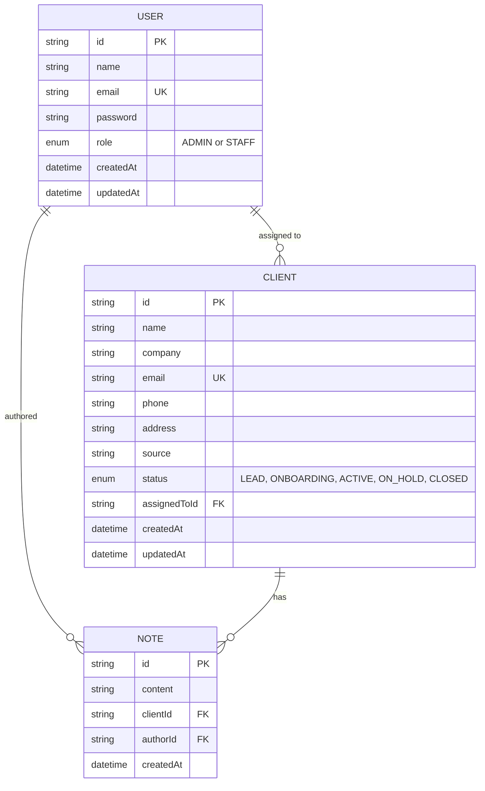
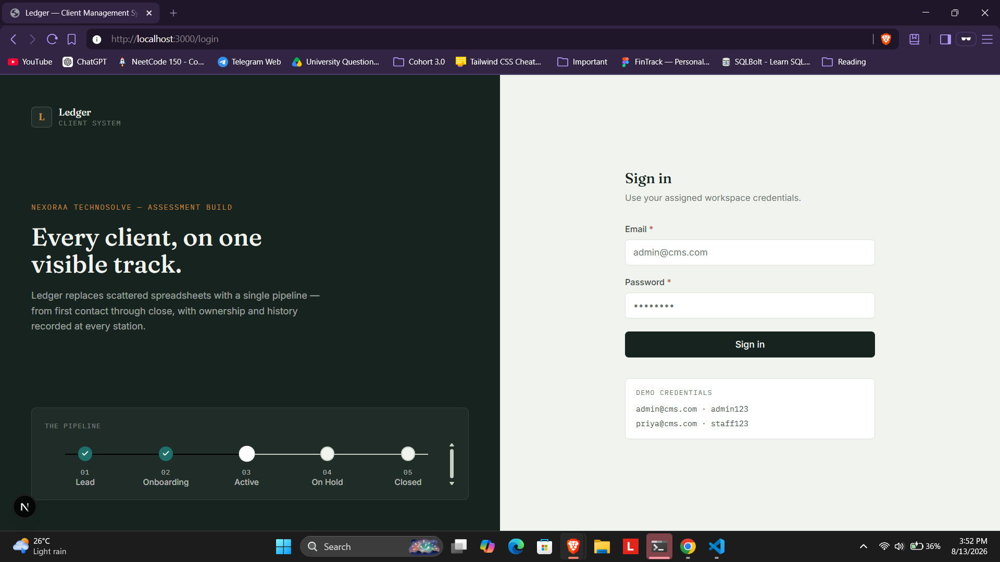
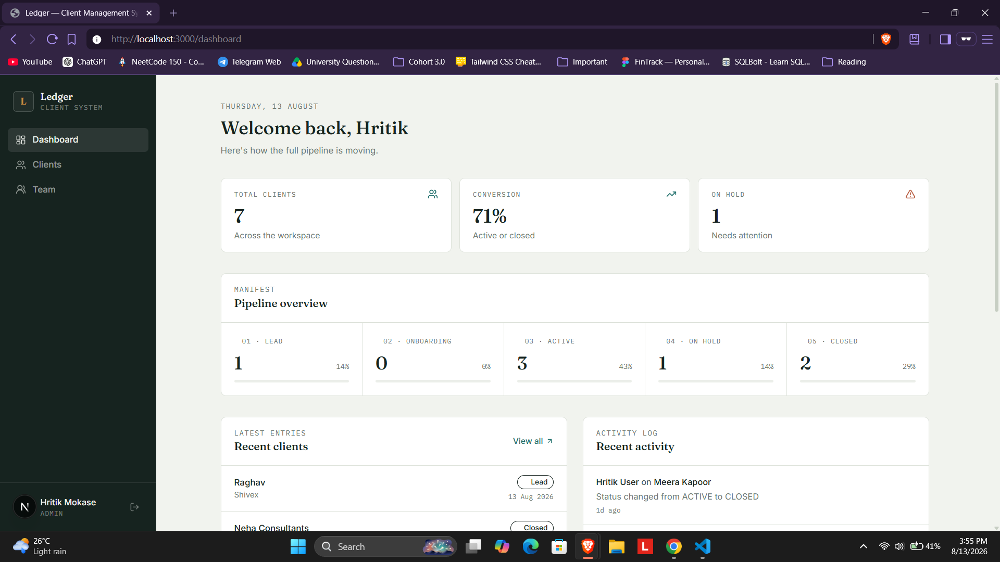
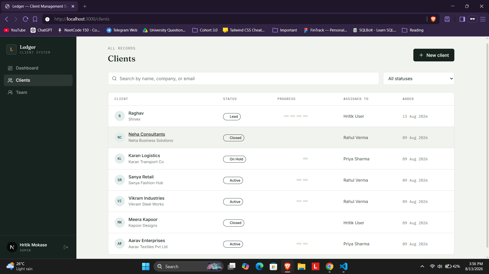
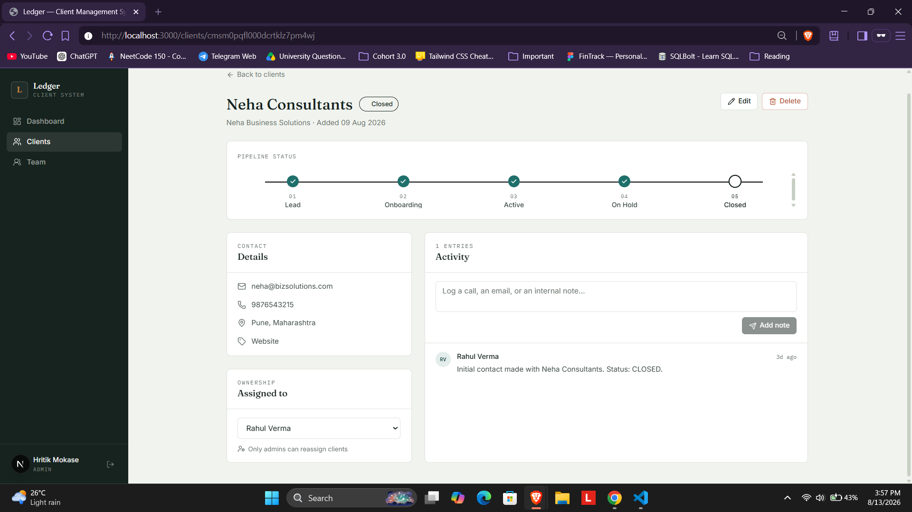
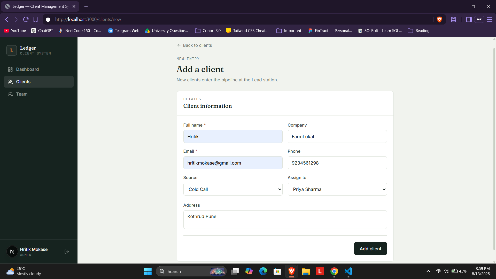
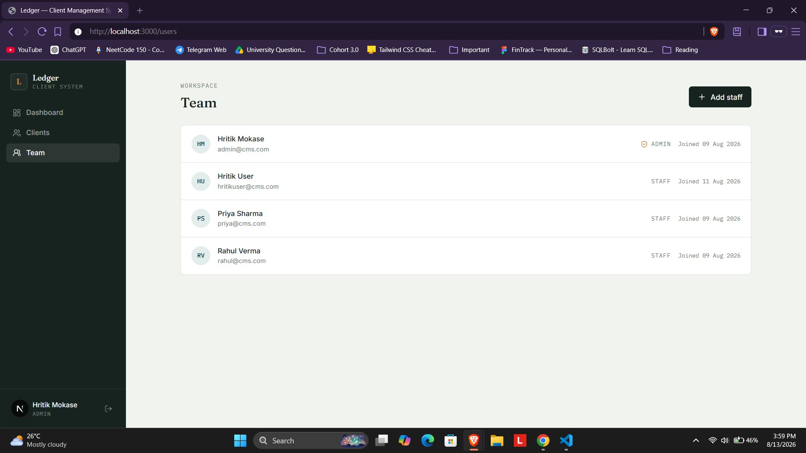

# Ledger — Client Management System

A full-stack Client Management System built for the **Nexoraa Technosolve
Full Stack Developer** technical assessment. It replaces manual client
tracking with a centralized pipeline (Lead → Onboarding → Active → On Hold →
Closed), role-based access, an audit-logged activity trail, and a reporting
dashboard.

**Author:** Hritik Mokase
**Live demo:** _add your deployed URLs here once deployed — see [Deployment](#deployment)_

---

## Table of Contents

- [Project Overview](#project-overview)
- [Tech Stack](#tech-stack)
- [Repository Structure](#repository-structure)
- [Key Features](#key-features)
- [Quickstart (Local Setup)](#quickstart-local-setup)
- [Environment Variables](#environment-variables)
- [Database Schema / ER Diagram](#database-schema--er-diagram)
- [API Documentation](#api-documentation)
- [Test Cases & Sample Data](#test-cases--sample-data)
- [Screenshots](#screenshots)
- [Deployment](#deployment)
- [Assumptions Made](#assumptions-made)
- [Known Limitations](#known-limitations)
- [Future Enhancements](#future-enhancements)

---

## Project Overview

Organizations often track clients through spreadsheets or scattered notes,
with no enforced process and no single view of where each relationship
stands. **Ledger** solves this with:

- A **fixed pipeline** every client moves through, with business rules that
  prevent illegal jumps (e.g. a client can't skip straight from *Lead* to
  *Active* without going through *Onboarding*).
- **Role-based workflows** — Admins see and manage everything; Staff only
  see clients assigned to them, enforced at the API level.
- An **audit trail** — every status change and manual note is timestamped
  and attributed to the user who made it.
- A **dashboard** summarizing pipeline health, conversion rate, and (for
  Admins) workload distribution across the team.

The system is built with the same tools and patterns used in production
applications (typed ORM, validated inputs, role middleware, JWT auth), so
the workflow can be extended rather than rebuilt.

## Tech Stack

| Layer | Technology |
|---|---|
| Frontend | Next.js 16 (App Router), TypeScript, Tailwind CSS v4 |
| Backend | Node.js, Express, TypeScript |
| Database | PostgreSQL (Neon), Prisma ORM 7 (driver adapter) |
| Auth | JWT + bcrypt, role-based middleware |
| Validation | Zod |
| Testing | Jest + Supertest (backend integration tests) |

## Repository Structure

```
client-management-system/
├── backend/            Express REST API
│   ├── prisma/          schema.prisma, seed.ts
│   ├── src/
│   │   ├── controllers/  route handlers / business logic
│   │   ├── middleware/   auth + role guards, error handler
│   │   ├── routes/
│   │   ├── lib/           prisma client, jwt, zod validators
│   │   ├── app.ts          Express app (imported by tests)
│   │   └── server.ts        entry point
│   ├── tests/              Jest + Supertest integration tests
│   └── README.md            backend-specific setup + full API reference
│
├── frontend/           Next.js application
│   ├── src/
│   │   ├── app/            pages (App Router)
│   │   ├── components/     UI, layout, pipeline, client, dashboard components
│   │   └── lib/              API client, auth context, types
│   └── README.md              frontend-specific setup + design notes
│
├── docs/
│   └── screenshots/          see Screenshots section below
│
└── README.md            (this file)
```

## Key Features

- **Authentication & authorization** — JWT-based login, bcrypt-hashed
  passwords, role checks enforced server-side on every protected route.
- **Client pipeline** — Lead → Onboarding → Active → On Hold → Closed, with
  transition rules enforced by the API (not just hidden in the UI).
- **Role-scoped data** — Staff can only ever query, view, or modify clients
  assigned to them; Admins have full visibility and can reassign or delete.
- **Activity log** — every note and every status change is recorded with
  author + timestamp, visible as a timeline per client.
- **Dashboard & reporting** — total clients, conversion rate, pipeline
  breakdown by stage, recent activity, and an Admin-only staff workload
  breakdown.
- **Team management** — Admins can create new Staff or Admin accounts.
- **Input validation & error handling** — every write endpoint validates
  with Zod and returns structured, field-level error messages; a
  centralized error handler normalizes all API error responses.

## Quickstart (Local Setup)

### Prerequisites
- Node.js 20+
- A PostgreSQL database — the fastest option is a free
  [Neon](https://neon.tech) project (~2 minutes to set up).

### 1. Clone
```bash
git clone https://github.com/hritikio/Client-Management-System.git
cd client-management-system
```

### 2. Backend (Terminal 1)
```bash
cd backend
npm install
cp .env.example .env   # fill in DATABASE_URL and JWT_SECRET
npx prisma generate
npx prisma db push
npm run seed
npm run dev
```
Runs at `http://localhost:5000`. `npm run seed` prints working login
credentials to the terminal.

### 3. Frontend (Terminal 2)
```bash
cd frontend
npm install
cp .env.example .env.local   # already points at localhost:5000/api
npm run dev
```
Runs at `http://localhost:3000`.

### 4. Log in
| Role | Email | Password |
|---|---|---|
| Admin | admin@cms.com | admin123 |
| Staff | priya@cms.com | staff123 |
| Staff | rahul@cms.com | staff123 |

Full setup detail for each half of the stack: [`backend/README.md`](./backend/README.md) · [`frontend/README.md`](./frontend/README.md)

## Environment Variables

**`backend/.env`**
| Variable | Description |
|---|---|
| `DATABASE_URL` | PostgreSQL connection string (Neon, include `?sslmode=require`) |
| `JWT_SECRET` | Long random string used to sign auth tokens |
| `PORT` | API port (default `5000`) |
| `FRONTEND_URL` | Frontend origin, used for CORS (default `http://localhost:3000`) |

**`frontend/.env.local`**
| Variable | Description |
|---|---|
| `NEXT_PUBLIC_API_URL` | Base URL of the backend API (default `http://localhost:5000/api`) |

## Database Schema / ER Diagram

Three models: **User** (Admin/Staff accounts), **Client** (the core pipeline
entity), and **Note** (activity log, also used to audit status changes).



Full model source:
[`backend/prisma/schema.prisma`](./backend/prisma/schema.prisma)

**Enforced pipeline transitions** (`backend/src/lib/validators.ts`):
```
LEAD        → ONBOARDING, CLOSED
ONBOARDING  → ACTIVE, ON_HOLD, CLOSED
ACTIVE      → ON_HOLD, CLOSED
ON_HOLD     → ACTIVE, CLOSED
CLOSED      → (terminal)
```

## API Documentation

Full endpoint-by-endpoint reference, request/response shapes, and business
rules live in [`backend/README.md`](./backend/README.md#api-documentation).
Summary:

| Group | Endpoints |
|---|---|
| Auth | `POST /api/auth/register`, `POST /api/auth/login`, `GET /api/auth/me` |
| Clients | `GET/POST /api/clients`, `GET/PATCH/DELETE /api/clients/:id`, `PATCH /api/clients/:id/status` |
| Notes | `GET/POST /api/clients/:clientId/notes` |
| Dashboard | `GET /api/dashboard` |
| Users | `GET /api/users` (Admin only) |

## Test Cases & Sample Data

**Sample data**: `backend/prisma/seed.ts` creates 3 users (1 Admin, 2 Staff)
and 6 clients spread across every pipeline stage — this is the realistic
sample data referenced throughout the assessment brief.

**Automated tests**: `backend/tests/` contains a Jest + Supertest
integration suite that runs against a real database and exercises the
actual business rules — not mocks. Run it with:

```bash
cd backend
npm install
npm test
```

| Suite | Covers |
|---|---|
| `tests/auth.test.ts` | Registration, duplicate email rejection, password validation, login success/failure, `/me` |
| `tests/clients.test.ts` | Client creation & validation, duplicate email rejection, **role-scoped visibility** (Staff can't see another Staff's clients), **valid vs. illegal pipeline transitions**, reassignment permissions (Admin-only), delete permissions (Admin-only) |
| `tests/dashboard-and-users.test.ts` | Dashboard scoping by role, Admin-only user listing, unauthenticated request rejection, 404 handling |

**Manual test case log** (representative sample — the automated suite above
covers these same paths programmatically):

| # | Test | Steps | Expected Result | Result |
|---|---|---|---|---|
| 1 | Login with valid credentials | POST `/api/auth/login` with seeded admin credentials | 200, returns token + user | Pass |
| 2 | Login with wrong password | POST `/api/auth/login` with wrong password | 401, generic error message | Pass |
| 3 | Create client missing email | POST `/api/clients` without `email` | 400, field-level validation error | Pass |
| 4 | Duplicate client email | POST `/api/clients` with an email already in use | 409 Conflict | Pass |
| 5 | Illegal status jump | PATCH status `LEAD → ACTIVE` | 400, transition rejected | Pass |
| 6 | Valid status transition | PATCH status `LEAD → ONBOARDING` | 200, status updated, note auto-logged | Pass |
| 7 | Staff views another staff's client | GET `/api/clients/:id` for an unassigned client, as Staff | 403 Forbidden | Pass |
| 8 | Staff attempts reassignment | PATCH `/api/clients/:id` with `assignedToId`, as Staff | 403 Forbidden | Pass |
| 9 | Admin reassigns client | PATCH `/api/clients/:id` with `assignedToId`, as Admin | 200, `assignedToId` updated | Pass |
| 10 | Staff attempts delete | DELETE `/api/clients/:id`, as Staff | 403 Forbidden | Pass |
| 11 | Admin deletes client | DELETE `/api/clients/:id`, as Admin | 204 No Content | Pass |
| 12 | Unauthenticated request | GET `/api/clients` with no token | 401 Unauthorized | Pass |

_Run `npm test` in `backend/` to reproduce these results directly._

## Screenshots

> Add screenshots to `docs/screenshots/` using the filenames below — the
> images will then render automatically in this section on GitHub.

| Screen | File |
|---|---|
| Login page | `docs/screenshots/01-login.png` |
| Dashboard (Admin view) | `docs/screenshots/02-dashboard.png` |
| Clients list with filters | `docs/screenshots/03-clients-list.png` |
| Client detail — pipeline rail + notes | `docs/screenshots/04-client-detail.png` |
| Add client form | `docs/screenshots/05-new-client.png` |
| Team page (Admin only) | `docs/screenshots/06-team.png` |

<!--






-->

_Uncomment the image block above once the files are added._

A short demo video (2–3 minutes) covering login → create client → move it
through the pipeline → add a note → check the dashboard is an equally valid
substitute per the assessment brief — link it here if recorded instead.

## Deployment

Not required for local evaluation, but the app is structured to deploy
cleanly as two separate services.

### Backend → Render / Railway
1. Create a new **Web Service** from this repo, root directory `backend`.
2. Build command: `npm install && npx prisma generate && npm run build`
3. Start command: `npm start`
4. Environment variables: `DATABASE_URL`, `JWT_SECRET`, `FRONTEND_URL` (your deployed frontend URL), `PORT` (usually auto-provided by the platform).

### Frontend → Vercel
1. Import this repo, set the project root to `frontend`.
2. Environment variable: `NEXT_PUBLIC_API_URL` → your deployed backend URL + `/api`.
3. Deploy — Vercel auto-detects Next.js, no extra config needed.

After deploying both, update `FRONTEND_URL` on the backend to the real
Vercel URL so CORS allows requests from it.

## Assumptions Made

- Single-organization use — no multi-tenancy; all Admins and Staff share
  one workspace.
- Two roles only (Admin, Staff); no finer-grained permission levels.
- A client has at most one assigned Staff member at a time.
- The five-stage pipeline (Lead/Onboarding/Active/On Hold/Closed) and its
  transition rules are treated as fixed business rules for this
  assessment; a production deployment would likely make these configurable
  per organization.
- Client email is treated as a unique business identifier — duplicate
  emails are rejected rather than allowing multiple records per client.
- JWT-based stateless auth is sufficient for this assessment's scope; no
  "log out everywhere" or token revocation list.

## Known Limitations

- No password reset / forgot-password flow.
- No email notifications on status changes.
- No pagination on the clients list (fine at demo data volumes).
- Auth token stored in `localStorage`, not an httpOnly cookie.
- No file/document attachments per client.

## Future Enhancements

- Pagination and column sorting on the clients table
- Email notifications on status transitions
- File attachments per client
- Self-service password reset
- Audit log export (CSV)
- Configurable pipeline stages per organization